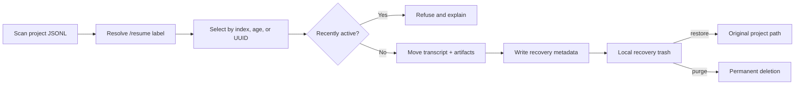

<div align="center">


# Claude Session Cleaner

**A safe, recoverable terminal session manager for Claude Code.**

[](https://github.com/ihoooohi/claude-code-session-cleaner/actions/workflows/ci.yml)
[](https://github.com/ihoooohi/claude-code-session-cleaner/releases/latest)
[](https://github.com/ihoooohi/claude-code-session-cleaner/stargazers)
[](./LICENSE)
[](https://www.gnu.org/software/bash/)
[](#requirements)

No telemetry · No cloud · No database

[**Quick start**](#quick-start) · [**Commands**](#command-reference) · [**Safety**](#safety-by-design) · [**Contributing**](./CONTRIBUTING.md)

[**English**](./README.md) | [**中文**](./README_CN.md)

</div>

---

## Why ccsc?

Claude Code stores conversations as JSONL transcripts under `~/.claude/projects`. Once `/resume` becomes crowded, manually matching encoded project paths, UUID files, and sibling artifact directories is slow—and one incorrect `rm` is permanent.

`ccsc` turns that storage into a focused terminal product. It uses the same labels as `/resume`, protects recently active work, and moves complete sessions into a recoverable local trash.

<table>
<tr>
<td width="33%" valign="top">
<h3>🛟 Recoverable</h3>
Transcripts and their derivative artifacts move together. Restore puts both back at the exact original path.
</td>
<td width="33%" valign="top">
<h3>🛡️ Defensive</h3>
Active sessions, ambiguous UUIDs, restore conflicts, and destructive bulk actions are explicitly refused.
</td>
<td width="33%" valign="top">
<h3>⚡ Scriptable</h3>
Project scoping, age-based cleanup previews, diagnostics, and JSON output work in terminals and automation.
</td>
</tr>
</table>

## Terminal experience

```console
$ ccsc --all list release

  ◆ Claude Session Cleaner v2.1.0
  Safe space for unfinished conversations.

  Sessions (newest first)

[  1] 2026-07-15 20:31  portfolio           728K  bcf9c007…  ★ polish the release
[  2] 2026-07-15 20:24  compiler             24K  34738f62…  fix parser edge case  ● active

  2 session(s) · all scope

$ ccsc --all clean --older-than 30d
  6 candidate session(s).
  Preview only. Re-run with --yes to move them to recoverable trash.
```

The same engine also powers `/delete-session` inside Claude Code, where natural selections such as `1 3-5`, `all`, or `all except 2` are resolved and confirmed conversationally.

## Features

- Recoverable local trash with conflict-safe restore and explicit permanent purge
- Transcript plus same-UUID `subagents`, tool results, and memory cleanup
- 10-minute active-session guard with a visible `● active` status
- `/resume`-compatible label priority: custom title → latest prompt → user message
- Safe age policies such as `clean --older-than 30d`, preview-only by default
- Environment diagnostics through `ccsc doctor`
- Current-project, all-project, explicit-path, keyword, and UUID-prefix lookup
- Structured JSON for session lists, stats, and cleanup previews
- Bash 3.2 compatibility with macOS and Linux CI

## Requirements

- macOS or Linux
- Bash 3.2+
- [`jq`](https://jqlang.github.io/jq/download/)

Run `ccsc doctor` after installation to validate the complete environment.

## Quick start

```bash
git clone https://github.com/ihoooohi/claude-code-session-cleaner.git
cd claude-code-session-cleaner
./install.sh
ccsc doctor
ccsc
```

The idempotent installer adds `ccsc` to `~/.local/bin` and installs `/delete-session` under `~/.claude`. Existing files are never replaced unless `--force` is supplied.

If needed, add the binary directory to your shell profile:

```bash
export PATH="$HOME/.local/bin:$PATH"
```

## Command reference

| Command | Purpose | Destructive? |
|---|---|:---:|
| `ccsc` | Open the interactive browser for the current project | No |
| `ccsc list [pattern]` | List or filter current-project sessions | No |
| `ccsc --all list` | List sessions across every project | No |
| `ccsc --project /path list` | Inspect an explicit project | No |
| `ccsc stats` | Show session, project, storage, and trash totals | No |
| `ccsc doctor` | Diagnose dependencies, storage, and permissions | No |
| `ccsc clean --older-than 30d` | Preview sessions matching an age policy | No |
| `ccsc clean --older-than 30d --yes` | Move previewed sessions to recoverable trash | Recoverable |
| `ccsc trash <uuid>...` | Move exact sessions to recoverable trash | Recoverable |
| `ccsc restore [uuid]` | List trash or restore one session | No |
| `ccsc purge <uuid>` | Permanently delete one trash entry | **Yes** |
| `ccsc purge --all` | Permanently empty the recovery trash | **Yes** |

Use `--json` with `list`, `stats`, or a `clean` preview:

```bash
ccsc --all --json clean --older-than 30d | jq '.[].uuid'
```

## How it works



Every trash entry is self-contained: `session.jsonl`, an optional `artifacts/` directory, and `metadata.json` with the UUID, original path, and trash timestamp. A failed artifact move rolls the transcript back instead of leaving a half-moved session.

## Safety by design

| Risk | Guardrail |
|---|---|
| Current conversation is selected | Sessions modified inside the active threshold are refused |
| UUID prefix matches multiple files | Ambiguous prefixes never resolve automatically |
| Bulk policy catches too much | `clean` is preview-only until explicit `--yes` |
| Subagent/tool data becomes orphaned | Transcript and derivative directory move as one transaction |
| Restore would overwrite a session | Existing destinations are never replaced |
| User confuses trash with deletion | Recoverable `trash` and irreversible `purge` are separate commands |

## Design decisions

- **Local-first:** session contents never leave the machine.
- **Trash over undo:** filesystem moves remain understandable and inspectable without a database.
- **Policy previews:** bulk cleanup separates selection from mutation.
- **Small dependency surface:** Bash and `jq` keep installation auditable and portable.
- **Real storage format:** labels come directly from Claude Code JSONL records rather than a parallel index.

## Configuration

| Variable | Default | Meaning |
|---|---|---|
| `CLAUDE_HOME` | `~/.claude` | Claude Code data directory |
| `CCSC_PROJECTS_DIR` | `$CLAUDE_HOME/projects` | Session storage override |
| `CCSC_TRASH_DIR` | `$CLAUDE_HOME/session-cleaner-trash` | Recovery trash location |
| `CCSC_ACTIVE_THRESHOLD_SEC` | `600` | Recent-session protection window |
| `NO_COLOR` | unset | Disable ANSI color when set |

## Project structure

```text
.
├── scripts/delete-session.sh   # CLI, JSONL parser, policy and recovery engine
├── commands/delete-session.md  # Claude Code conversational workflow
├── tests/test.sh               # isolated filesystem integration suite
├── assets/hero.svg             # repository artwork
├── .github/                    # CI, issue forms, and PR template
├── install.sh                  # idempotent installer
└── uninstall.sh                # uninstaller that preserves recovery data
```

## Development

```bash
bash tests/test.sh
shellcheck scripts/delete-session.sh install.sh uninstall.sh tests/test.sh
```

Tests use a temporary `CLAUDE_HOME`; they never inspect or mutate real sessions. GitHub Actions runs the suite on macOS and Ubuntu and applies ShellCheck to every pull request.

See [CONTRIBUTING.md](./CONTRIBUTING.md) for the development workflow and [SECURITY.md](./SECURITY.md) for responsible disclosure.

## FAQ

<details>
<summary><strong>Does ccsc upload or analyze my conversations?</strong></summary>
<br />No. It only reads and moves local files. There is no telemetry, network request, account, or hosted service.
</details>

<details>
<summary><strong>Can it remove the conversation I am currently using?</strong></summary>
<br />The active-session guard is designed to refuse it. Use another terminal for cleanup and never lower the threshold merely to bypass that protection.
</details>

<details>
<summary><strong>What happens when Claude Code adds native session deletion?</strong></summary>
<br />Native deletion solves one operation. ccsc still provides recovery, storage diagnostics, policy previews, JSON automation, and complete artifact cleanup.
</details>

## Roadmap

- Size-aware cleanup policies (`--larger-than`)
- Storage trends and per-project insights
- Optional desktop trash integration

## Acknowledgements

Built from real-world Claude Code storage behavior and community feedback. Thanks to all [contributors](https://github.com/ihoooohi/claude-code-session-cleaner/graphs/contributors). Native deletion is tracked in [anthropics/claude-code#26904](https://github.com/anthropics/claude-code/issues/26904).

## License

Released under the [MIT License](./LICENSE).
