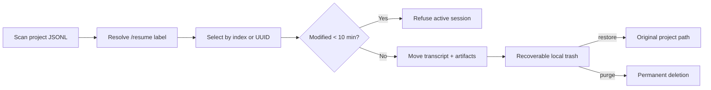

<div align="center">


# Claude Session Cleaner

[](https://github.com/ihoooohi/claude-code-session-cleaner/actions/workflows/ci.yml)
[](./LICENSE)
[](https://www.gnu.org/software/bash/)
[](#requirements)

**A safe, recoverable session manager for Claude Code.**

[**English**](./README.md) | [**中文**](./README_CN.md)

</div>

---

## Overview

Claude Code stores every conversation as a JSONL transcript under `~/.claude/projects`, but managing those files by hand is error-prone. Claude Session Cleaner (`ccsc`) turns that storage into a polished terminal experience: browse sessions using the same labels as `/resume`, reclaim space without touching active work, and restore anything moved by mistake.

It works both as a standalone CLI and as a conversational `/delete-session` command inside Claude Code.

## Features

- **Recoverable by default** — sessions go to a private local trash, never straight to `rm`.
- **Complete cleanup** — moves the transcript and its sibling artifacts (`subagents`, tool results, and memory) together.
- **Active-session guard** — refuses sessions modified in the last 10 minutes.
- **Familiar labels** — resolves `/rename` titles, latest prompts, and fallback user messages in the same priority as `/resume`.
- **Fast navigation** — current-project scope by default, with global, path, keyword, and UUID-prefix lookup.
- **Automation friendly** — stable non-interactive commands and structured `--json` output.
- **Portable and small** — Bash 3.2 compatible; tested on macOS and Linux with no framework or build step.

## Project structure

```text
.
├── scripts/delete-session.sh   # CLI, storage parser, trash engine, terminal UI
├── commands/delete-session.md  # Claude Code slash-command workflow
├── tests/test.sh               # isolated filesystem integration tests
├── assets/hero.svg             # GitHub project artwork
├── .github/workflows/ci.yml    # macOS + Linux CI and ShellCheck
├── install.sh                  # idempotent installer
└── uninstall.sh                # safe uninstaller (keeps recoverable trash)
```

## Requirements

- macOS or Linux
- Bash 3.2+
- [`jq`](https://jqlang.github.io/jq/download/)

## Quick start

```bash
git clone https://github.com/ihoooohi/claude-code-session-cleaner.git
cd claude-code-session-cleaner
./install.sh
ccsc
```

The installer adds `ccsc` to `~/.local/bin`, and installs the compatibility script and `/delete-session` command under `~/.claude`. It never replaces a different existing file unless `--force` is supplied.

If `~/.local/bin` is not on your `PATH`, add it in your shell profile:

```bash
export PATH="$HOME/.local/bin:$PATH"
```

## How it works



Each trash entry contains the original transcript, derivative artifact directory, and a small metadata file recording its original path. Restore checks for destination conflicts before rebuilding the session exactly where Claude Code expects it.

## Minimal examples

```bash
# Browse the current project in the interactive terminal UI
ccsc

# Search every project, or consume results as JSON
ccsc --all list "release"
ccsc --all --json list | jq '.[].uuid'

# Inspect storage, recover a session, or permanently empty trash
ccsc stats
ccsc restore                 # list recoverable sessions
ccsc restore 9f362cce
ccsc purge --all             # irreversible
```

Inside Claude Code, run `/delete-session`. The command lists candidates, interprets selections such as `1 3-5` or `all except 2`, and always asks for confirmation before moving anything.

## Safety model

| Risk | Guardrail |
|---|---|
| Deleting the current conversation | Modification-time guard rejects recently active sessions |
| Leaving orphaned agent/tool data | Transcript and same-UUID artifact directory move as one unit |
| Ambiguous short UUID | Zero or multiple matches are refused |
| Accidental deletion | `trash` is recoverable; permanent deletion is a separate `purge` command |
| Restore overwrite | Existing destinations are never replaced |

Set `CCSC_ACTIVE_THRESHOLD_SEC` to customize the guard. Set `NO_COLOR=1` for plain output. `CLAUDE_HOME` and `CCSC_PROJECTS_DIR` make the storage root configurable for testing and nonstandard installations.

## Development

```bash
bash tests/test.sh
shellcheck scripts/delete-session.sh install.sh uninstall.sh tests/test.sh
```

The tests run against an isolated temporary Claude home, so they never inspect or mutate your real sessions. Contributions are welcome; see the pull request safety checklist.

## Roadmap

- Age and size based cleanup policies (`--older-than`, `--larger-than`)
- Optional desktop trash integration
- Storage trends and per-project insights

This project began as a stopgap while native session deletion is discussed in [anthropics/claude-code#26904](https://github.com/anthropics/claude-code/issues/26904). Even if the native command lands, the recoverable storage browser and diagnostics remain useful.

## License

Released under the [MIT License](./LICENSE).
