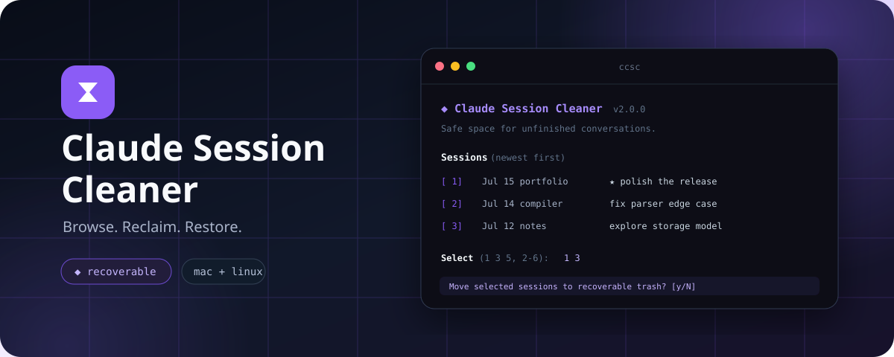
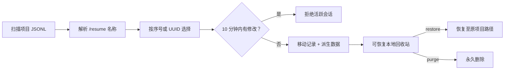

<div align="center">



# Claude Session Cleaner

[](https://github.com/ihoooohi/claude-code-session-cleaner/actions/workflows/ci.yml)
[](./LICENSE)
[](https://www.gnu.org/software/bash/)
[](#环境要求)

**一个安全、可恢复的 Claude Code 会话管理器。**

[**English**](./README.md) | [**中文**](./README_CN.md)

</div>

---

## 项目简介

Claude Code 会把每次对话保存为 `~/.claude/projects` 下的 JSONL 文件，但直接手动管理这些文件既麻烦又容易误删。Claude Session Cleaner（`ccsc`）把底层存储变成一套精致的终端体验：用和 `/resume` 一致的名称浏览会话，在不影响当前工作的前提下释放空间，并能恢复任何误操作的会话。

它既能作为独立 CLI 使用，也能作为 Claude Code 内的 `/delete-session` 对话式命令使用。

## 功能亮点

- **默认可恢复** — 会话进入本地私有回收站，不会直接执行 `rm`。
- **完整清理** — 对话记录与同 UUID 的派生数据（子代理、工具结果、记忆）一起移动。
- **活跃会话保护** — 拒绝处理最近 10 分钟内仍有修改的会话。
- **熟悉的名称** — 按 `/resume` 的优先级解析 `/rename` 标题、最新提示词和用户消息。
- **高效定位** — 默认聚焦当前项目，也支持全局、路径、关键词和 UUID 前缀查找。
- **适合自动化** — 提供稳定的非交互命令和结构化 `--json` 输出。
- **轻量跨平台** — 兼容 Bash 3.2，通过 macOS 与 Linux 测试，无框架、无需构建。

## 项目结构

```text
.
├── scripts/delete-session.sh   # CLI、存储解析、回收站引擎、终端 UI
├── commands/delete-session.md  # Claude Code 斜杠命令工作流
├── tests/test.sh               # 隔离文件系统的集成测试
├── assets/hero.svg             # GitHub 项目视觉封面
├── .github/workflows/ci.yml    # macOS + Linux CI 与 ShellCheck
├── install.sh                  # 幂等安装器
└── uninstall.sh                # 安全卸载器（保留可恢复回收站）
```

## 环境要求

- macOS 或 Linux
- Bash 3.2+
- [`jq`](https://jqlang.github.io/jq/download/)

## 快速开始

```bash
git clone https://github.com/ihoooohi/claude-code-session-cleaner.git
cd claude-code-session-cleaner
./install.sh
ccsc
```

安装器会把 `ccsc` 放入 `~/.local/bin`，同时在 `~/.claude` 下安装兼容脚本和 `/delete-session` 命令。除非显式传入 `--force`，它不会覆盖内容不同的已有文件。

如果 `~/.local/bin` 不在 `PATH` 中，请把下面一行加入 shell 配置：

```bash
export PATH="$HOME/.local/bin:$PATH"
```

## 工作原理



每个回收站条目都包含原始对话、派生数据目录，以及记录原路径的小型元数据文件。恢复前会检查目标冲突，再把会话准确还原到 Claude Code 预期的位置。

## 最小示例

```bash
# 在交互式终端 UI 中浏览当前项目
ccsc

# 搜索所有项目，或以 JSON 形式消费结果
ccsc --all list "release"
ccsc --all --json list | jq '.[].uuid'

# 查看空间、恢复会话，或永久清空回收站
ccsc stats
ccsc restore                 # 列出可恢复会话
ccsc restore 9f362cce
ccsc purge --all             # 不可恢复
```

在 Claude Code 中运行 `/delete-session`。它会列出候选项，理解 `1 3-5`、`除 2 外全部` 等选择，并在移动任何内容前再次确认。

## 安全模型

| 风险 | 防护措施 |
|---|---|
| 误删当前对话 | 修改时间保护会拒绝近期活跃会话 |
| 遗留子代理或工具数据 | 对话记录与同 UUID 派生目录作为整体移动 |
| UUID 短前缀有歧义 | 匹配零条或多条时直接拒绝 |
| 操作失误 | `trash` 可恢复；永久删除由独立的 `purge` 命令完成 |
| 恢复时覆盖文件 | 目标已存在时绝不覆盖 |

可用 `CCSC_ACTIVE_THRESHOLD_SEC` 调整保护时间；用 `NO_COLOR=1` 获得纯文本输出。`CLAUDE_HOME` 与 `CCSC_PROJECTS_DIR` 支持测试环境和非标准存储路径。

## 开发

```bash
bash tests/test.sh
shellcheck scripts/delete-session.sh install.sh uninstall.sh tests/test.sh
```

测试只操作临时 Claude Home，不会查看或修改你的真实会话。欢迎贡献代码，提交前请检查 Pull Request 中的安全清单。

## 路线图

- 按时间和大小清理（`--older-than`、`--larger-than`）
- 可选的系统桌面回收站集成
- 空间趋势与项目维度统计

这个项目最初用于填补原生会话删除能力的空白，相关讨论见 [anthropics/claude-code#26904](https://github.com/anthropics/claude-code/issues/26904)。即使未来官方命令上线，可恢复的存储浏览和诊断能力仍然具有价值。

## 许可证

本项目采用 [MIT License](./LICENSE)。
