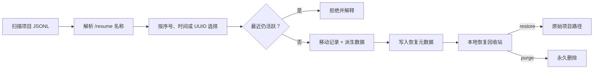

<div align="center">


# Claude Session Cleaner

**一个安全、可恢复的 Claude Code 终端会话管理器。**

[](https://github.com/ihoooohi/claude-code-session-cleaner/actions/workflows/ci.yml)
[](https://github.com/ihoooohi/claude-code-session-cleaner/releases/latest)
[](https://github.com/ihoooohi/claude-code-session-cleaner/stargazers)
[](./LICENSE)
[](https://www.gnu.org/software/bash/)
[](#环境要求)

无遥测 · 无云服务 · 无数据库

[**快速开始**](#快速开始) · [**命令参考**](#命令参考) · [**安全设计**](#安全设计) · [**参与贡献**](./CONTRIBUTING.md)

[**English**](./README.md) | [**中文**](./README_CN.md)

</div>

---

## 为什么选择 ccsc？

Claude Code 将对话保存为 `~/.claude/projects` 下的 JSONL 文件。当 `/resume` 逐渐拥挤，手动匹配编码后的项目路径、UUID 文件和派生目录既低效又危险——一次错误的 `rm` 就无法挽回。

`ccsc` 把这套底层存储变成专注的终端产品：显示与 `/resume` 一致的名称，保护最近活跃的工作，并将完整会话移入可恢复的本地回收站。

<table>
<tr>
<td width="33%" valign="top">
<h3>🛟 可恢复</h3>
对话记录与派生数据作为整体移动；恢复时准确回到原始路径。
</td>
<td width="33%" valign="top">
<h3>🛡️ 防误操作</h3>
活跃会话、歧义 UUID、恢复冲突和危险批量操作都会被明确拒绝。
</td>
<td width="33%" valign="top">
<h3>⚡ 可自动化</h3>
项目范围、按时间预览清理、环境诊断和 JSON 输出均可用于终端与脚本。
</td>
</tr>
</table>

## 终端体验

```console
$ ccsc --all list release

  ◆ Claude Session Cleaner v2.1.0
  Safe space for unfinished conversations.

  Sessions (newest first)

[  1] 2026-07-15 20:31  portfolio           728K  bcf9c007…  ★ polish the release
[  2] 2026-07-15 20:24  compiler             24K  34738f62…  fix parser edge case  ● active

  2 session(s) · all scope

$ ccsc --all clean --older-than 30d
  6 candidate session(s).
  Preview only. Re-run with --yes to move them to recoverable trash.
```

同一个引擎也驱动 Claude Code 内的 `/delete-session`，可以用自然语言选择 `1 3-5`、`全部` 或 `除 2 外全部`，并在执行前再次确认。

## 功能特性

- 可恢复本地回收站、冲突安全恢复与独立永久清空
- 同步处理对话记录及同 UUID 的子代理、工具结果与记忆
- 10 分钟活跃会话保护，并显示 `● active` 状态
- 与 `/resume` 一致的名称优先级：自定义标题 → 最新提示词 → 用户消息
- `clean --older-than 30d` 安全时间策略，默认只预览
- `ccsc doctor` 一键诊断运行环境
- 支持当前项目、全部项目、指定路径、关键词和 UUID 前缀定位
- 列表、统计和清理预览均支持结构化 JSON
- 兼容 Bash 3.2，通过 macOS 与 Linux CI

## 环境要求

- macOS 或 Linux
- Bash 3.2+
- [`jq`](https://jqlang.github.io/jq/download/)

安装完成后运行 `ccsc doctor` 即可验证完整环境。

## 快速开始

```bash
git clone https://github.com/ihoooohi/claude-code-session-cleaner.git
cd claude-code-session-cleaner
./install.sh
ccsc doctor
ccsc
```

幂等安装器会把 `ccsc` 放入 `~/.local/bin`，并在 `~/.claude` 下安装 `/delete-session`。除非显式使用 `--force`，否则绝不覆盖内容不同的已有文件。

如有需要，请把二进制目录加入 shell 配置：

```bash
export PATH="$HOME/.local/bin:$PATH"
```

## 命令参考

| 命令 | 用途 | 破坏性 |
|---|---|:---:|
| `ccsc` | 打开当前项目的交互式浏览器 | 否 |
| `ccsc list [pattern]` | 列出或过滤当前项目会话 | 否 |
| `ccsc --all list` | 列出全部项目会话 | 否 |
| `ccsc --project /path list` | 查看指定项目 | 否 |
| `ccsc stats` | 查看会话、项目、空间与回收站统计 | 否 |
| `ccsc doctor` | 诊断依赖、存储和权限 | 否 |
| `ccsc clean --older-than 30d` | 预览符合时间策略的会话 | 否 |
| `ccsc clean --older-than 30d --yes` | 将预览结果移入可恢复回收站 | 可恢复 |
| `ccsc trash <uuid>...` | 将指定会话移入可恢复回收站 | 可恢复 |
| `ccsc restore [uuid]` | 列出回收站或恢复一条会话 | 否 |
| `ccsc purge <uuid>` | 永久删除一条回收站记录 | **是** |
| `ccsc purge --all` | 永久清空回收站 | **是** |

`list`、`stats` 和 `clean` 预览均可使用 `--json`：

```bash
ccsc --all --json clean --older-than 30d | jq '.[].uuid'
```

## 工作原理



每个回收站条目都是完整、自描述的：`session.jsonl`、可选的 `artifacts/`，以及包含 UUID、原路径和回收时间的 `metadata.json`。如果派生目录移动失败，程序会回滚对话记录，不留下“移动一半”的状态。

## 安全设计

| 风险 | 防护措施 |
|---|---|
| 选中当前对话 | 活跃阈值内有修改的会话会被拒绝 |
| UUID 前缀匹配多条 | 歧义前缀绝不自动推断 |
| 批量策略范围过大 | `clean` 默认只预览，必须显式 `--yes` |
| 遗留子代理或工具数据 | 对话记录与派生目录按事务整体移动 |
| 恢复覆盖已有会话 | 目标存在时绝不覆盖 |
| 混淆回收与删除 | 可恢复 `trash` 与不可恢复 `purge` 使用独立命令 |

## 设计决策

- **本地优先：** 对话内容永不离开机器。
- **回收站而非黑盒撤销：** 文件移动无需数据库，状态清晰可检查。
- **策略先预览：** 批量选择与实际修改明确分离。
- **最小依赖面：** Bash 与 `jq` 让安装过程可审计、可移植。
- **直接读取真实格式：** 名称来自 Claude Code JSONL，而不是维护另一套索引。

## 配置

| 变量 | 默认值 | 含义 |
|---|---|---|
| `CLAUDE_HOME` | `~/.claude` | Claude Code 数据目录 |
| `CCSC_PROJECTS_DIR` | `$CLAUDE_HOME/projects` | 会话存储覆盖路径 |
| `CCSC_TRASH_DIR` | `$CLAUDE_HOME/session-cleaner-trash` | 恢复回收站位置 |
| `CCSC_ACTIVE_THRESHOLD_SEC` | `600` | 最近会话保护窗口 |
| `NO_COLOR` | 未设置 | 设置后禁用 ANSI 颜色 |

## 项目结构

```text
.
├── scripts/delete-session.sh   # CLI、JSONL 解析、策略与恢复引擎
├── commands/delete-session.md  # Claude Code 对话式工作流
├── tests/test.sh               # 隔离文件系统集成测试
├── assets/hero.svg             # 仓库视觉素材
├── .github/                    # CI、Issue 表单与 PR 模板
├── install.sh                  # 幂等安装器
└── uninstall.sh                # 保留恢复数据的卸载器
```

## 开发

```bash
bash tests/test.sh
shellcheck scripts/delete-session.sh install.sh uninstall.sh tests/test.sh
```

测试使用临时 `CLAUDE_HOME`，不会查看或修改真实会话。GitHub Actions 会在每个 Pull Request 上运行 macOS、Ubuntu 测试与 ShellCheck。

开发流程见 [CONTRIBUTING.md](./CONTRIBUTING.md)，安全问题报告方式见 [SECURITY.md](./SECURITY.md)。

## 常见问题

<details>
<summary><strong>ccsc 会上传或分析我的对话吗？</strong></summary>
<br />不会。它只读写本地文件，没有遥测、网络请求、账号或云服务。
</details>

<details>
<summary><strong>它会删除我正在使用的对话吗？</strong></summary>
<br />活跃会话保护会拒绝这种操作。请从另一个终端清理，也不要为了绕过保护而随意调低阈值。
</details>

<details>
<summary><strong>Claude Code 官方支持删除后，这个项目还有意义吗？</strong></summary>
<br />原生删除只解决一个操作；ccsc 仍提供恢复、空间诊断、策略预览、JSON 自动化和完整派生数据清理。
</details>

## 路线图

- 按大小清理策略（`--larger-than`）
- 空间趋势与项目维度统计
- 可选的系统桌面回收站集成

## 致谢

项目源于真实的 Claude Code 存储行为和社区反馈。感谢所有[贡献者](https://github.com/ihoooohi/claude-code-session-cleaner/graphs/contributors)。官方删除能力讨论见 [anthropics/claude-code#26904](https://github.com/anthropics/claude-code/issues/26904)。

## 许可证

本项目采用 [MIT License](./LICENSE)。
